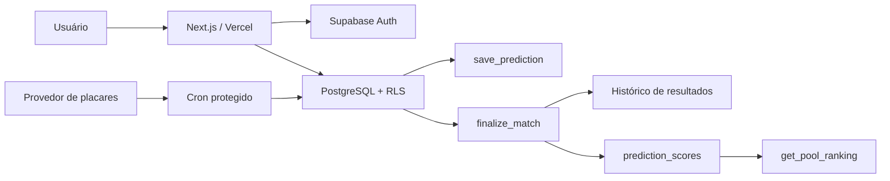

# Arquitetura e decisões

## Limites de confiança

O navegador nunca decide se um palpite ainda pode ser salvo e nunca calcula o
ranking oficial. Essas operações ficam no PostgreSQL:

- `save_prediction` bloqueia pela hora do servidor e valida classificado.
- `finalize_match` versiona o resultado e recalcula todos os palpites.
- RLS controla privacidade, participação em bolões e acesso administrativo.
- `get_pool_ranking` aplica a data de entrada para impedir pontos retroativos.
- `get_public_pools` e `get_public_pool_ranking` entregam somente dados seguros,
  paginados e sem códigos de convite.
- `get_my_pools` agrega os bolões do usuário em uma consulta; rankings adicionais
  são carregados somente quando abertos.
- Linhas completas de perfil ficam visíveis apenas para o próprio usuário e
  para administradores globais; rankings expõem somente os dados necessários.
- `update_pool` usa arquivamento reversível e registra alterações auditáveis.
- `is_master_admin` separa operação de partidas do controle global exclusivo.

O motor em `src/lib/scoring.ts` existe para feedback rápido na interface. Os
testes TypeScript e pgTAP usam os mesmos casos para detectar divergências.

## Fluxos

## Modo demonstração

Sem `NEXT_PUBLIC_SUPABASE_URL` e `NEXT_PUBLIC_SUPABASE_ANON_KEY`, leituras usam
`src/lib/demo-data.ts` e escritas de interface usam `localStorage`. Isso permite
validar produto, responsividade e navegação sem infraestrutura. O endpoint de
saúde e o banner global deixam esse estado explícito. O modo demonstração não é
uma fonte oficial de agenda.

## Decisões operacionais

- Sincronização de placares observados a cada minuto, com confirmação humana
  obrigatória antes de finalizar e pontuar.
- Sportmonks é o provedor recomendado para produção; o feed público atual é
  contingência sem SLA.
- Se haverá palpites especiais, prêmios ou pagamentos. Pagamentos estão fora do
  MVP por risco jurídico e operacional.
- Fuso horário exibido. O primeiro release usa `America/Sao_Paulo` para dados
  vindos do banco.

## Falhas previstas

| Falha | Proteção atual |
| --- | --- |
| Usuário altera relógio do aparelho | Bloqueio atômico no PostgreSQL |
| Dois resultados diferentes para o mesmo jogo | Versionamento e histórico |
| Correção muda pontuação | Reprocessamento transacional |
| Entrada tardia ganha pontos antigos | `eligible_from` no ranking |
| Chave administrativa exposta | Service role não é importada no browser |
| Supabase indisponível no desenvolvimento | Fallback explícito para demo |
| Provedor informa placar incorreto | Observação separada da finalização oficial |
| Endpoint de sincronização é chamado por terceiros | `CRON_SECRET` obrigatório |
| Feed gratuito fica indisponível ou parcial | Fallback ESPN + validação das 104 partidas |
| Participante errado entra no mata-mata | Atribuição administrativa auditada e bloqueada após palpites |
| Visitante lista milhares de bolões | Descoberta pública paginada e limitada no banco |
| Exclusão acidental de bolão ou conta | Arquivamento e suspensão reversíveis |
| Frontend novo e migration entram em momentos diferentes | Exigência de termos ativada pelo master somente após o deploy |

Antes do lançamento, alertas de erro, backup e restauração do Supabase devem ser
testados em ambiente de homologação.
