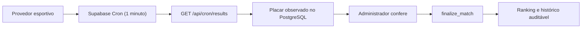

# Operação de agenda e resultados

## Fontes e responsabilidade

- A [FIFA](https://www.fifa.com/en/tournaments/mens/worldcup/canadamexicousa2026/articles/match-schedule-fixtures-results-teams-stadiums)
  é a fonte de verdade para participantes, confrontos, horários, locais e
  resultados finais.
- `data/world-cup-2026.json` contém as 48 seleções e 104 partidas verificadas em
  7 de junho de 2026. O arquivo foi estruturado com auxílio de um feed público e
  passa pelo validador completo do projeto antes de poder ser importado.
- `npm run schedule:verify:sources` compara automaticamente os horários com
  uma segunda agenda pública. Antes do início da Copa, a fonte secundária deve
  listar as 104 partidas; depois do início, algumas fontes removem jogos já
  disputados, então o script continua exigindo aderência para todos os jogos
  ainda presentes/futuros.
- Um provedor esportivo serve para velocidade operacional. Ele nunca deve
  substituir a conferência final quando houver divergência com a FIFA.

## Estratégia implementada



O endpoint protegido atualiza `live_home_score`, `live_away_score`,
`provider_status` e `provider_updated_at`. Quando o provedor marca uma partida
da fase de grupos como finalizada, o backend também pode chamar
`finalize_provider_group_matches` depois do atraso de segurança configurado em
`RESULTS_AUTO_FINALIZE_DELAY_MINUTES`. Jogos de mata-mata continuam exigindo
confirmação administrativa, porque dependem de quem avançou.

## Ativar sincronização

1. Na Vercel, configure:

```text
RESULTS_FEED_URL=https://worldcup26.ir/get/games
RESULTS_BACKUP_FEED_URL=
RESULTS_AUTO_FINALIZE_DELAY_MINUTES=10
CRON_SECRET=<segredo aleatório com pelo menos 32 caracteres>
SUPABASE_SERVICE_ROLE_KEY=<service role key do projeto Supabase>
```

Se `RESULTS_BACKUP_FEED_URL` ficar vazio, o app usa a agenda pública da ESPN
somente quando o feed principal falhar. Essa API secundária não é documentada
como produto para terceiros e também não possui SLA.

2. Faça um novo deploy.
3. No Supabase Dashboard, abra **Integrations > Cron** e crie uma chamada HTTP:

```text
Método: GET
URL: https://labolita.faysk.dev/api/cron/results
Agenda: * * * * *
Header: Authorization: Bearer <mesmo CRON_SECRET>
```

4. Valide manualmente:

```bash
npm run results:smoke:remote
```

O feed público acima é adequado como contingência e para validar o fluxo, mas
não oferece SLA conhecido. Mantenha confirmação humana obrigatória enquanto ele
for a fonte primária.

Cada execução do feed de resultados exige exatamente 104 observações com
identificadores únicos. O sistema rejeita feed parcial, placar informado muito
antes do início e regressão de `finished` para `live` ou `scheduled`. O resumo
da última tentativa, incluindo quantos jogos foram auto-finalizados, fica em
`results_sync_state` e também aparece em `/api/health`.

## Provedor recomendado

Para a Copa em produção, a recomendação é contratar o plano específico da
[Sportmonks](https://www.sportmonks.com/football-api/world-plan/). A
documentação informa cobertura dos 104 jogos, placares em menos de 15 segundos
e um endpoint de partidas alteradas nos últimos 10 segundos. O plano atual do
`football-data.org` configurado no projeto retorna `403` para a competição
`WC`, portanto não serve para esta Copa sem mudança de assinatura.

Antes de trocar para Sportmonks será necessário adicionar um adaptador para o
formato de resposta deles; a proteção, o endpoint, o cron e a confirmação
administrativa permanecem iguais.

## Procedimento por partida

1. Confirmar que horário e participantes estão corretos antes do bloqueio.
2. Acompanhar `provider_status` durante o jogo.
3. Depois do apito final, comparar o placar sugerido com a FIFA.
4. Em fase de grupos, conferir se a auto-finalização ocorreu corretamente ou
   corrigir pelo painel se houver divergência.
5. No mata-mata, confirmar pelo painel administrativo, informando placar, quem
   avançou e fonte.
6. Em caso de correção, usar novamente o painel com justificativa explícita.

Nunca considerar disputa por pênaltis no placar: registrar o resultado após a
prorrogação e informar separadamente quem avançou.

## Falhas e contingência

| Situação | Ação |
| --- | --- |
| Feed indisponível | Informar resultado manualmente após conferência |
| Feed diverge da FIFA | Não confirmar; aguardar/corrigir a fonte |
| Cron falha | Executar `npm run results:smoke:remote` e conferir logs |
| Feed principal falha | O fallback ESPN é usado; confirmar `fallback_used` no health |
| Feed parcial ou corrompido | A execução retorna 502 e não grava placares |
| Horário muda após bloqueio | Usar `update_match_schedule` com justificativa |
| Resultado é corrigido | Confirmar novamente; o banco recalcula e versiona |

Automatizar a finalização só deve ser considerado depois de observar o provedor
em produção e exigir, no mínimo, duas leituras finais idênticas, atraso de
segurança e fonte secundária.

## Capacidade no plano gratuito

Uma execução por minuto representa aproximadamente 44.640 chamadas em um mês
de 31 dias. Isso fica abaixo das 1.000.000 invocações mensais incluídas no
[Vercel Hobby](https://vercel.com/docs/accounts/plans/hobby). O
[Supabase Free](https://supabase.com/docs/pricing) informa 500 MB de banco, 5 GB
de egress e até 50.000 usuários ativos mensais.

O cenário atual é confortável para um beta privado. Acompanhe semanalmente o
Usage das duas plataformas, principalmente egress, tamanho do banco e duração
das funções. O [Supabase Cron](https://supabase.com/docs/guides/cron) recomenda
no máximo oito jobs concorrentes; o LaBolita usa apenas um.
