# Album de Figurinhas LaBolita

Catalogo das artes otimizadas usadas nos palpites especiais. As artes brutas ficam fora do repositorio para manter o projeto leve; o app consome as versoes WebP abaixo.

Para atualizar este album, adicione as artes em `output/imagegen/figurinha-anime/`, rode `npm run stickers:optimize` e depois `npm run stickers:album`.

## Resumo

- Figurinhas publicadas: 81
- Selecoes com artes: 43
- Tamanho total otimizado: 8.25 MB
- Formato publicado: WebP otimizado para web

## Algeria (ALG)

| Figurinha | Jogador | Posicao | Camisa | Clube |
|---|---|---|---:|---|
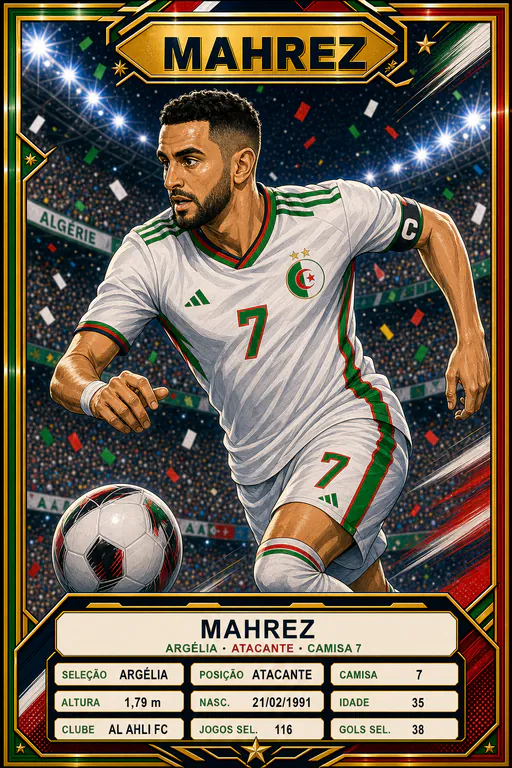 | Riyad Karim MAHREZ | Atacante | 7 | Al Ahli FC (KSA)
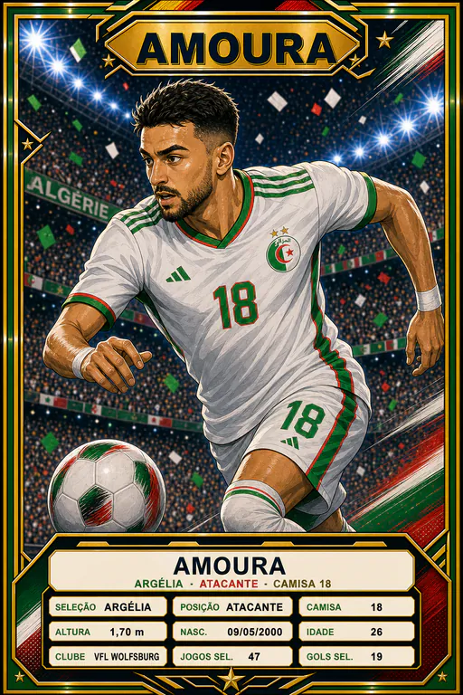 | Mohammed Elamine AMOURA | Atacante | 18 | VfL Wolfsburg (GER)

## Argentina (ARG)

| Figurinha | Jogador | Posicao | Camisa | Clube |
|---|---|---|---:|---|
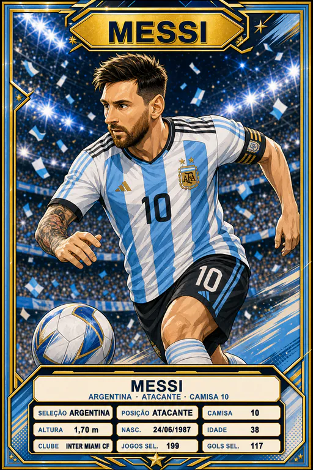 | Lionel Andrés MESSI | Atacante | 10 | Inter Miami CF (USA)
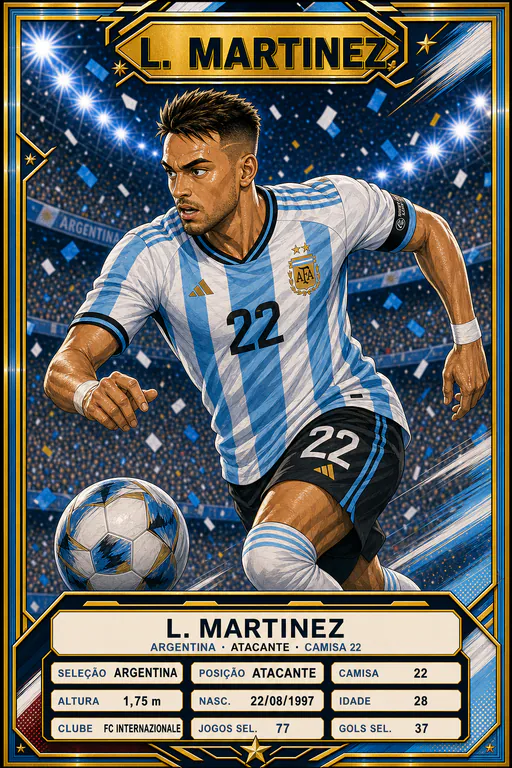 | Lautaro Javier MARTÍNEZ | Atacante | 22 | FC Internazionale Milano (ITA)

## Austria (AUT)

| Figurinha | Jogador | Posicao | Camisa | Clube |
|---|---|---|---:|---|
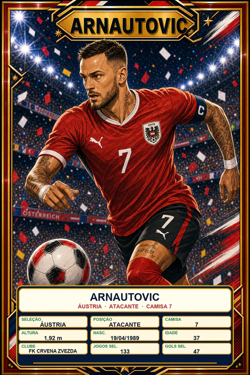 | Marko ARNAUTOVIC | Atacante | 7 | FK Crvena Zvezda (SRB)
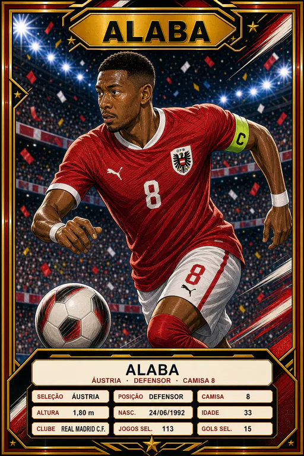 | David ALABA | Defensor | 8 | Real Madrid C. F. (ESP)
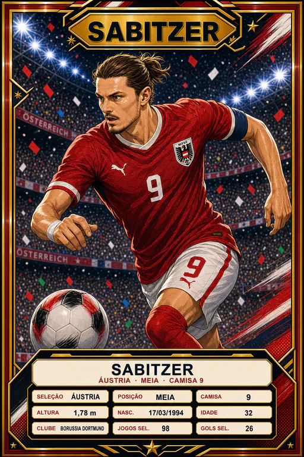 | Marcel SABITZER | Meio-campista | 9 | Borussia Dortmund (GER)
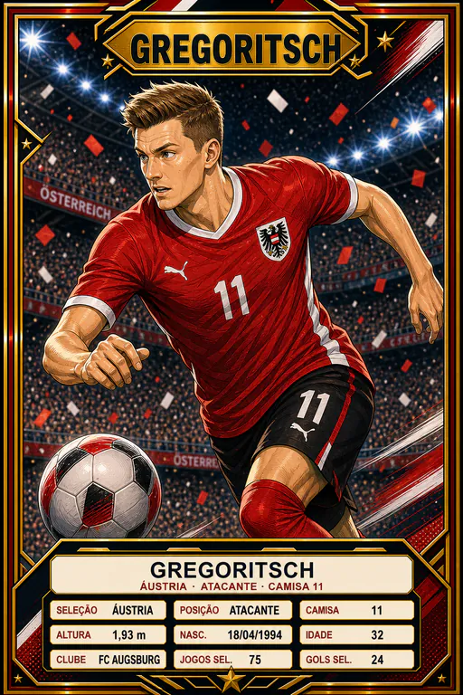 | Michael GREGORITSCH | Atacante | 11 | FC Augsburg (GER)

## Belgium (BEL)

| Figurinha | Jogador | Posicao | Camisa | Clube |
|---|---|---|---:|---|
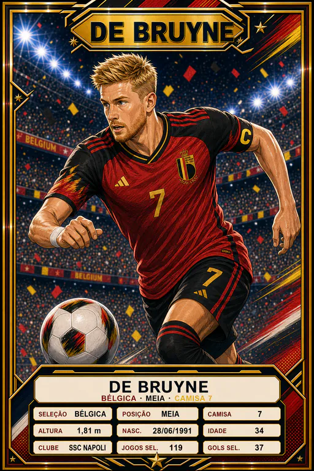 | Kevin DE BRUYNE | Meio-campista | 7 | SSC Napoli (ITA)
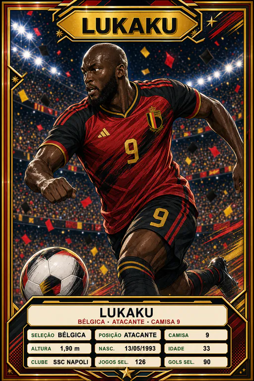 | Romelu LUKAKU BOLINGOLI | Atacante | 9 | SSC Napoli (ITA)

## Bosnia And Herzegovina (BIH)

| Figurinha | Jogador | Posicao | Camisa | Clube |
|---|---|---|---:|---|
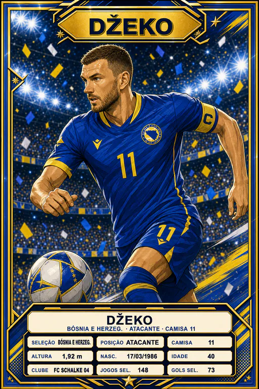 | Edin DŽEKO | Atacante | 11 | FC Schalke 04 (GER)

## Brazil (BRA)

| Figurinha | Jogador | Posicao | Camisa | Clube |
|---|---|---|---:|---|
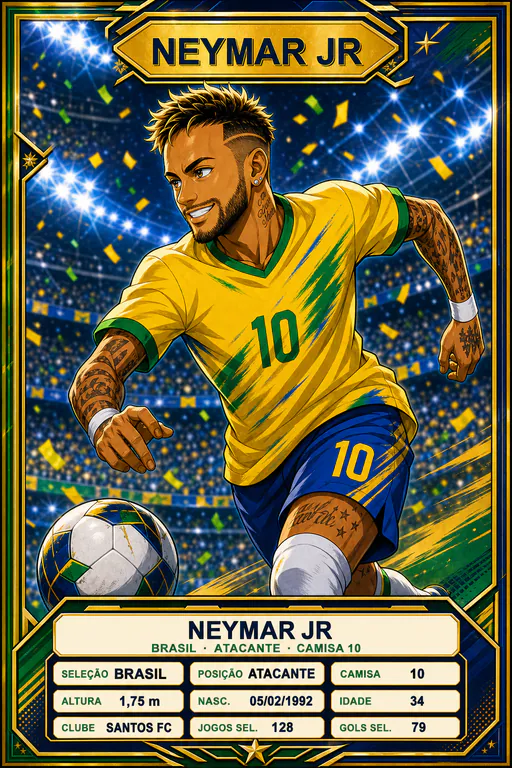 | Neymar DA SILVA SANTOS JÚNIOR | Atacante | 10 | Santos FC (BRA)

## Cabo Verde (CPV)

| Figurinha | Jogador | Posicao | Camisa | Clube |
|---|---|---|---:|---|
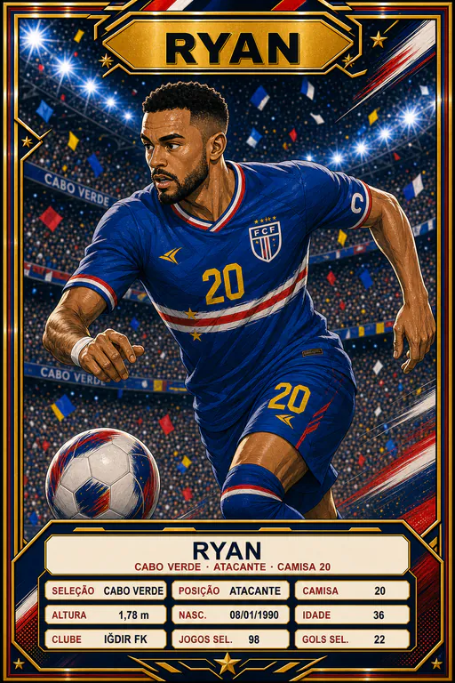 | Ryan Isaac DA GRACA MENDES | Atacante | 20 | Iğdır FK (TUR)

## Canada (CAN)

| Figurinha | Jogador | Posicao | Camisa | Clube |
|---|---|---|---:|---|
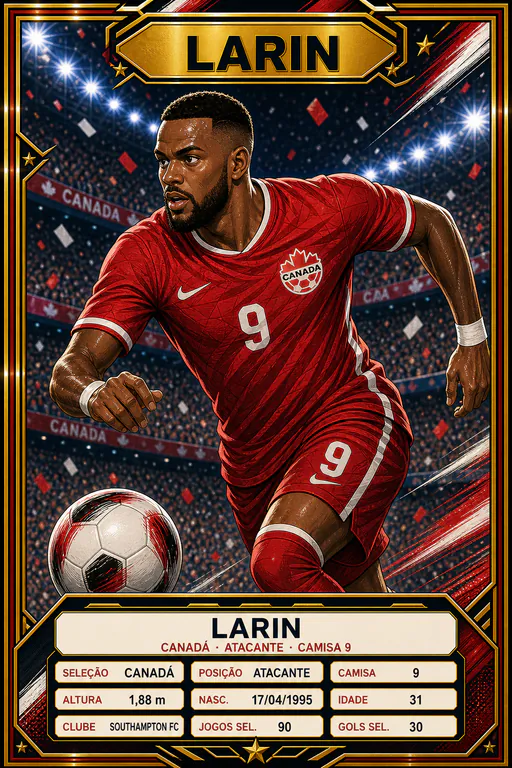 | Cyle Christopher LARIN | Atacante | 9 | Southampton FC (ENG)
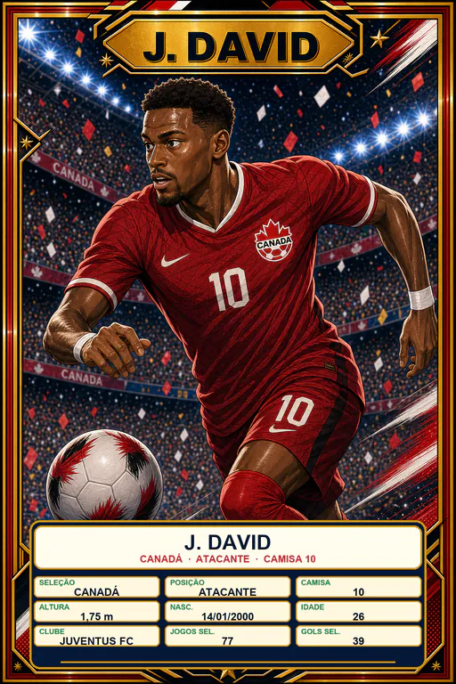 | Jonathan Christian DAVID | Atacante | 10 | Juventus FC (ITA)

## Colombia (COL)

| Figurinha | Jogador | Posicao | Camisa | Clube |
|---|---|---|---:|---|
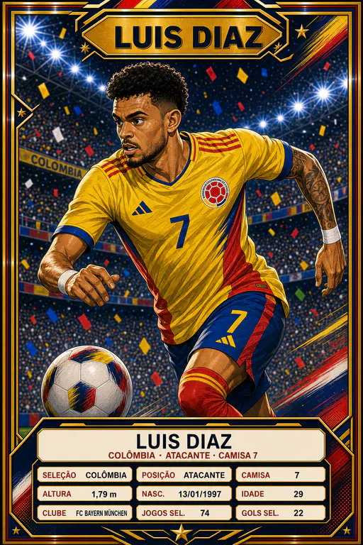 | Luis Fernando DÍAZ MARULANDA | Atacante | 7 | FC Bayern München (GER)
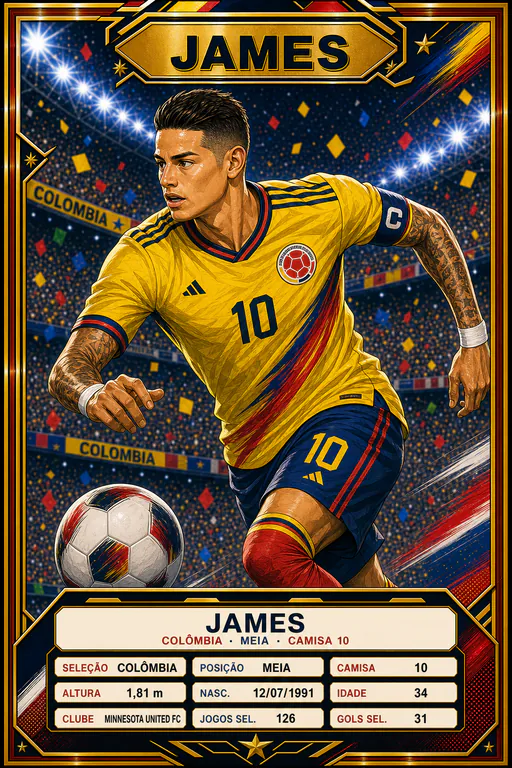 | James David RODRÍGUEZ RUBIO | Meio-campista | 10 | Minnesota United FC (USA)

## Congo DR (COD)

| Figurinha | Jogador | Posicao | Camisa | Clube |
|---|---|---|---:|---|
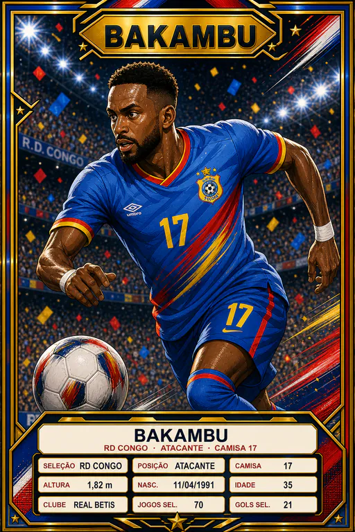 | Cedric BAKAMBU | Atacante | 17 | Real Betis (ESP)

## Côte D'Ivoire (CIV)

| Figurinha | Jogador | Posicao | Camisa | Clube |
|---|---|---|---:|---|
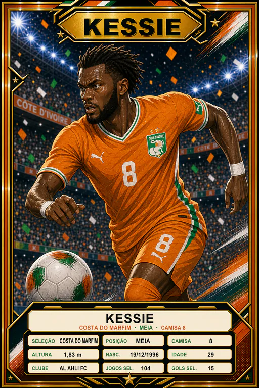 | Franck Yannick KESSIE | Meio-campista | 8 | Al Ahli FC (KSA)

## Croatia (CRO)

| Figurinha | Jogador | Posicao | Camisa | Clube |
|---|---|---|---:|---|
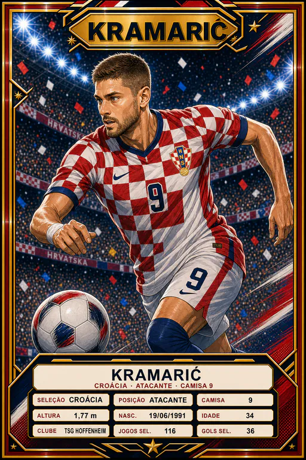 | Andrej KRAMARIĆ | Atacante | 9 | TSG Hoffenheim (GER)
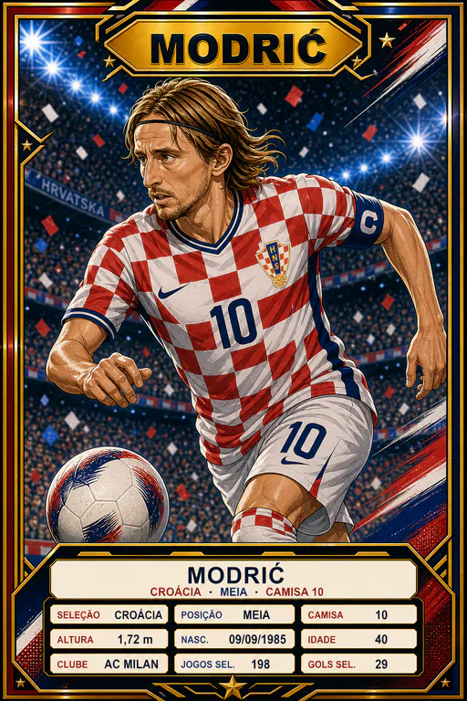 | Luka MODRIĆ | Meio-campista | 10 | AC Milan (ITA)
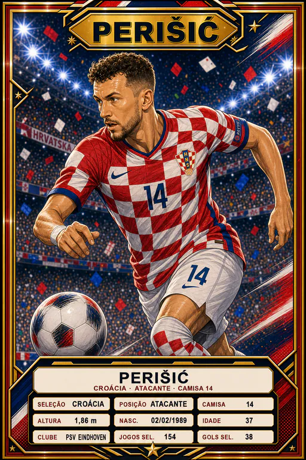 | Ivan PERIŠIĆ | Atacante | 14 | PSV Eindhoven (NED)

## Curaçao (CUW)

| Figurinha | Jogador | Posicao | Camisa | Clube |
|---|---|---|---:|---|
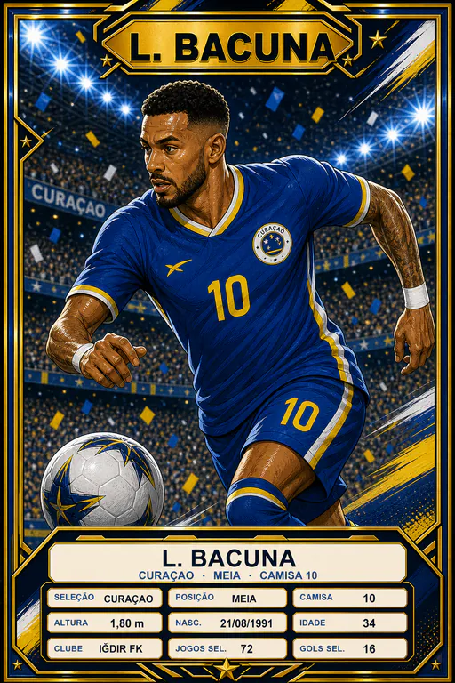 | Leandro Jones Johan BACUNA | Meio-campista | 10 | Iğdır FK (TUR)

## Czechia (CZE)

| Figurinha | Jogador | Posicao | Camisa | Clube |
|---|---|---|---:|---|
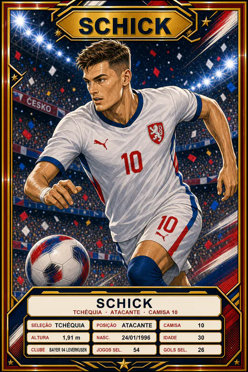 | Patrik SCHICK | Atacante | 10 | Bayer 04 Leverkusen (GER)
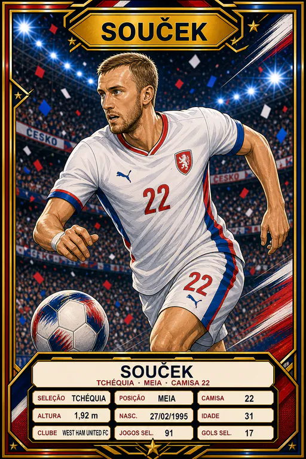 | Tomáš SOUČEK | Meio-campista | 22 | West Ham United FC (ENG)

## Ecuador (ECU)

| Figurinha | Jogador | Posicao | Camisa | Clube |
|---|---|---|---:|---|
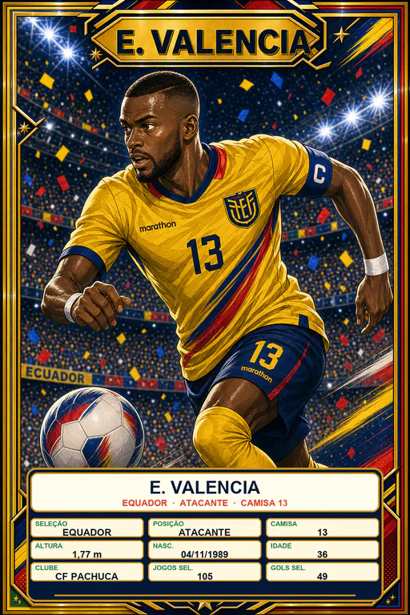 | Enner Remberto VALENCIA LASTRA | Atacante | 13 | CF Pachuca (MEX)

## Egypt (EGY)

| Figurinha | Jogador | Posicao | Camisa | Clube |
|---|---|---|---:|---|
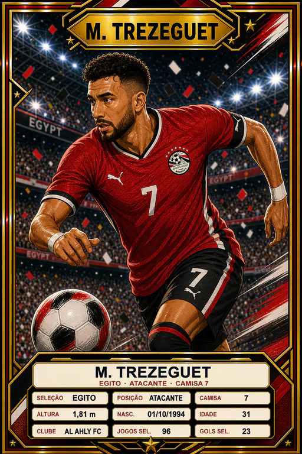 | Mahmoud Ahmed Ibrahim HASSAN | Atacante | 7 | Al Ahly FC (EGY)
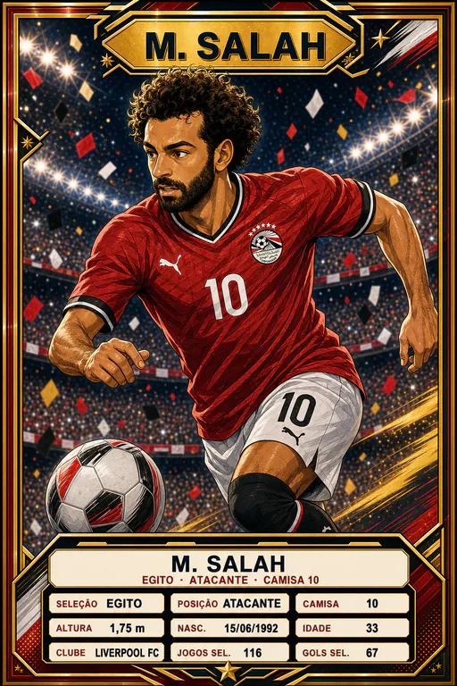 | Mohamed Salah Hamed Mahrous GHALY | Atacante | 10 | Liverpool FC (ENG)

## England (ENG)

| Figurinha | Jogador | Posicao | Camisa | Clube |
|---|---|---|---:|---|
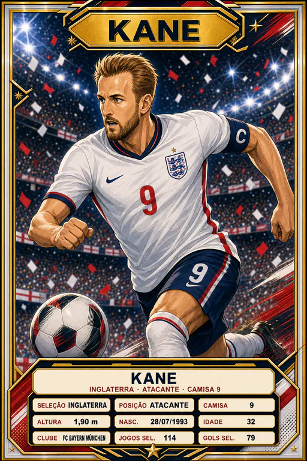 | Harry Edward KANE | Atacante | 9 | FC Bayern München (GER)
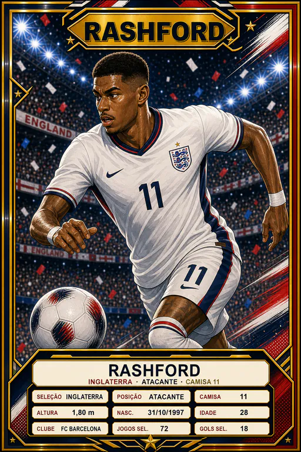 | Marcus RASHFORD | Atacante | 11 | FC Barcelona (ESP)

## France (FRA)

| Figurinha | Jogador | Posicao | Camisa | Clube |
|---|---|---|---:|---|
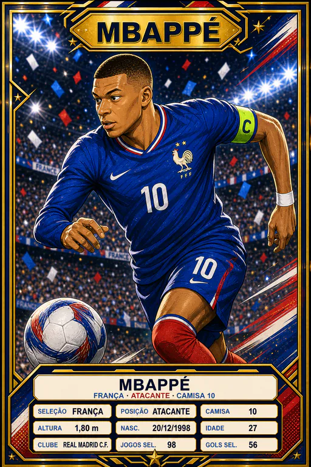 | Kylian MBAPPE LOTTIN | Atacante | 10 | Real Madrid C. F. (ESP)

## Germany (GER)

| Figurinha | Jogador | Posicao | Camisa | Clube |
|---|---|---|---:|---|
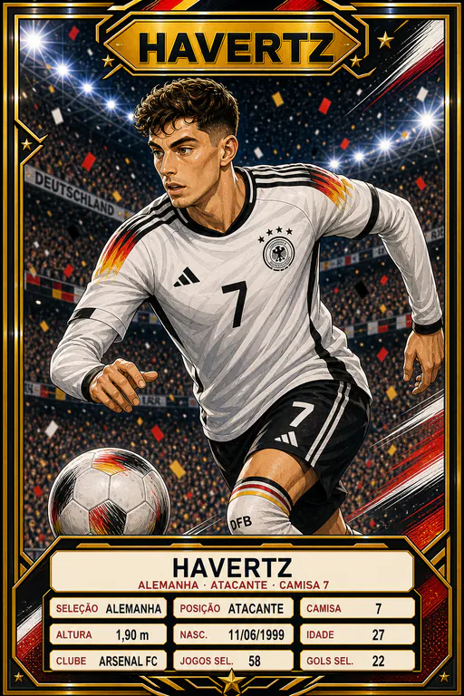 | Kai Lukas HAVERTZ | Atacante | 7 | Arsenal FC (ENG)
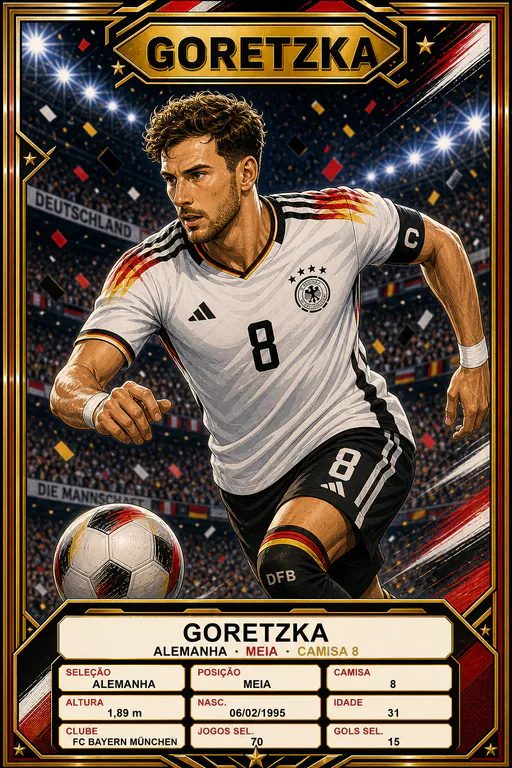 | Leon Christoph GORETZKA | Meio-campista | 8 | FC Bayern München (GER)
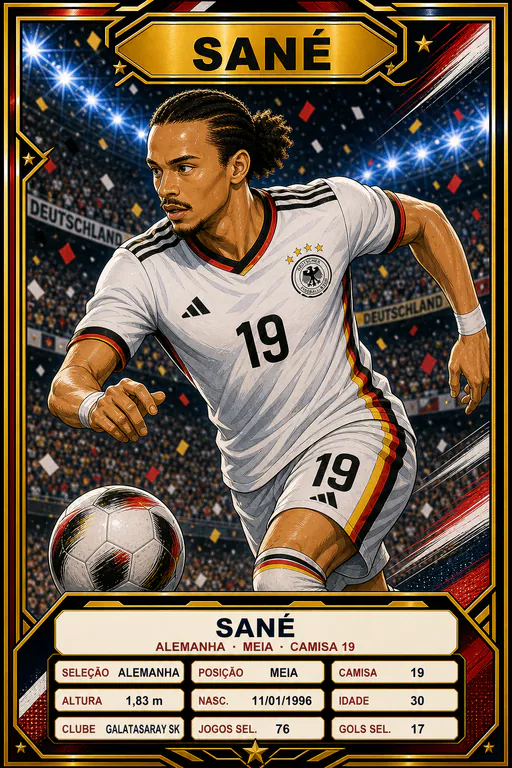 | Leroy Aziz SANÉ | Meio-campista | 19 | Galatasaray SK (TUR)

## Ghana (GHA)

| Figurinha | Jogador | Posicao | Camisa | Clube |
|---|---|---|---:|---|
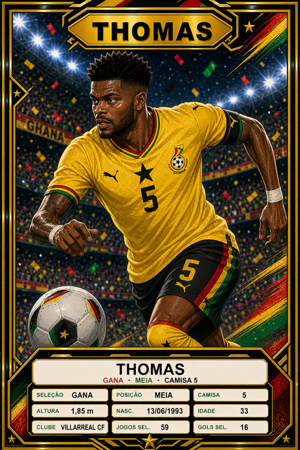 | Thomas Teye PARTEY | Meio-campista | 5 | Villarreal CF (ESP)
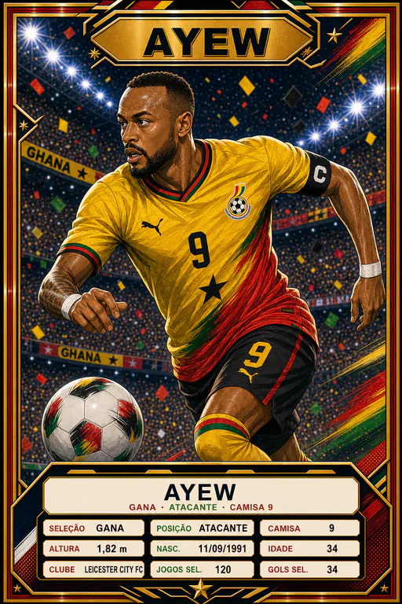 | Jordan Pierre AYEW | Atacante | 9 | Leicester City FC (ENG)

## Haiti (HAI)

| Figurinha | Jogador | Posicao | Camisa | Clube |
|---|---|---|---:|---|
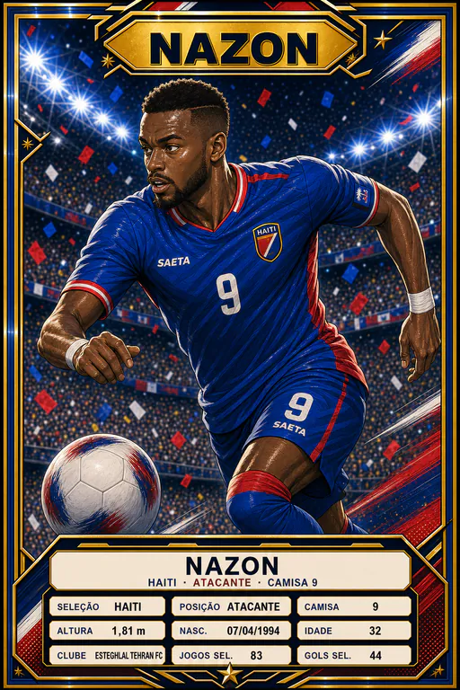 | Duckens NAZON | Atacante | 9 | Esteghlal Tehran FC (IRN)
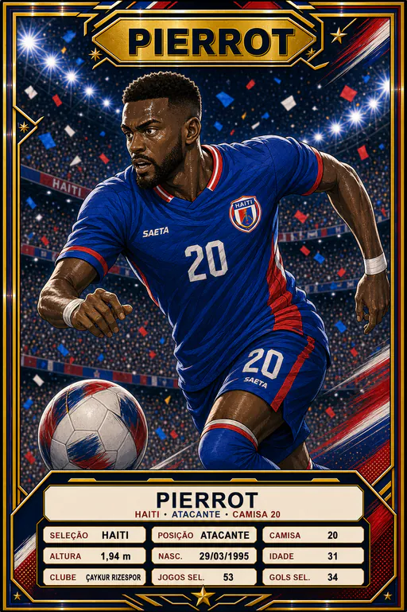 | Frantzdy PIERROT | Atacante | 20 | Çaykur Rizespor (TUR)

## IR Iran (IRN)

| Figurinha | Jogador | Posicao | Camisa | Clube |
|---|---|---|---:|---|
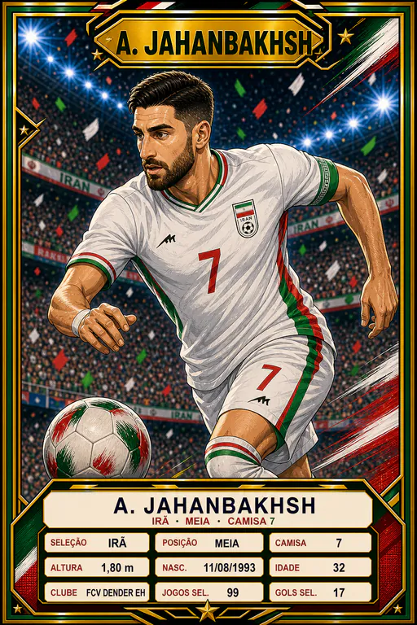 | Alireza JAHANBAKHSH JIRANDEH | Meio-campista | 7 | FCV Dender EH (BEL)
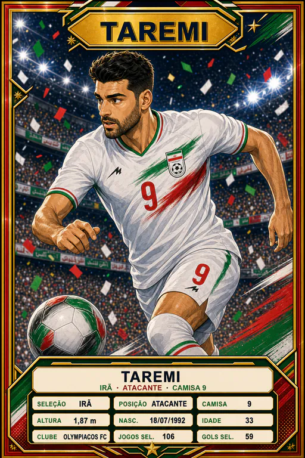 | Mehdi TAREMI | Atacante | 9 | Olympiacos FC (GRE)

## Iraq (IRQ)

| Figurinha | Jogador | Posicao | Camisa | Clube |
|---|---|---|---:|---|
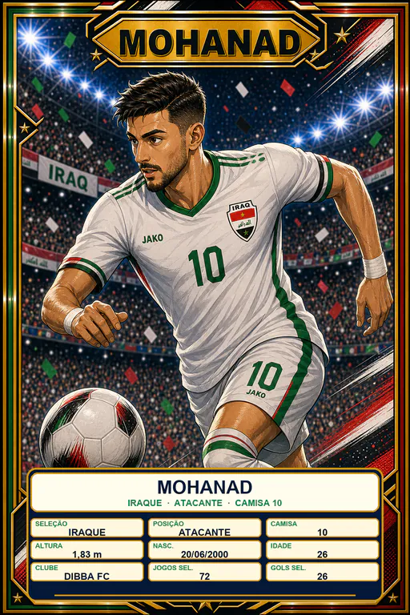 | Mohanad Ali Kadhim AL-SHAMMARI | Atacante | 10 | Dibba FC (UAE)
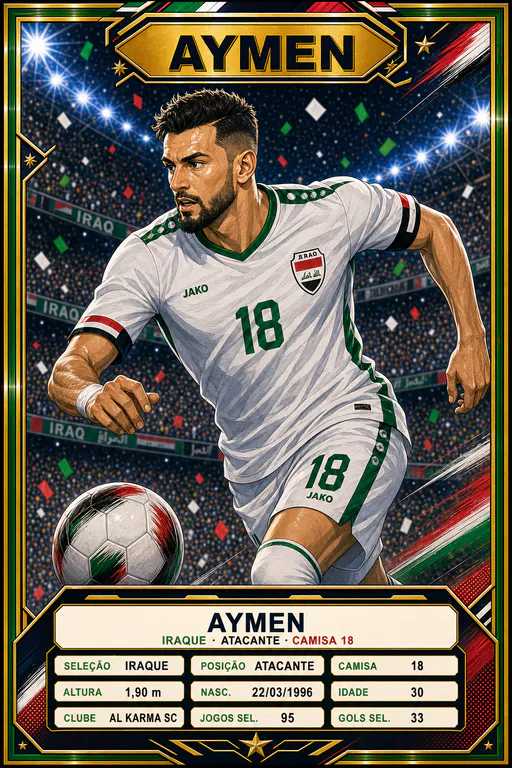 | Aymen Hussein Ghadhban GHADHBAN | Atacante | 18 | Al Karma SC (IRQ)

## Japan (JPN)

| Figurinha | Jogador | Posicao | Camisa | Clube |
|---|---|---|---:|---|
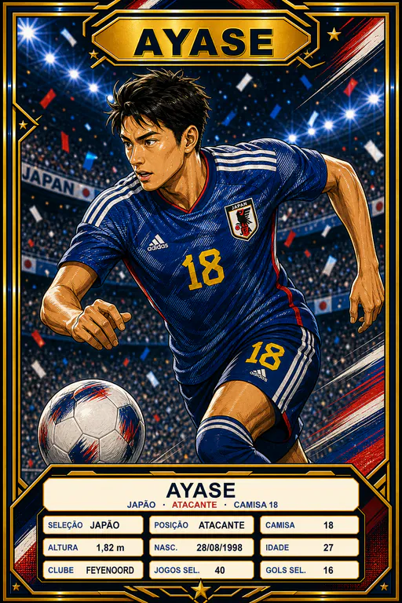 | Ayase UEDA | Atacante | 18 | Feyenoord Rotterdam (NED)

## Jordan (JOR)

| Figurinha | Jogador | Posicao | Camisa | Clube |
|---|---|---|---:|---|
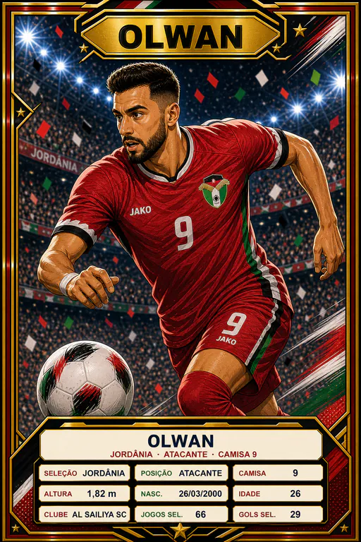 | Ali Iyad Ali OLWAN | Atacante | 9 | Al Sailiya SC (QAT)
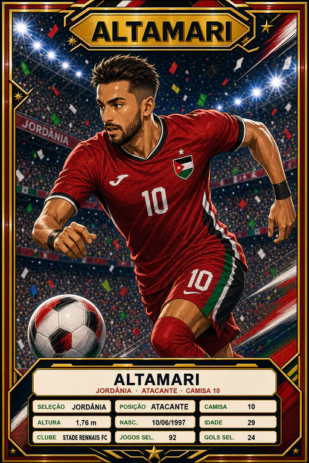 | Mousa Mohammad Mousa SULEIMAN | Atacante | 10 | Stade Rennais FC (FRA)

## Korea Republic (KOR)

| Figurinha | Jogador | Posicao | Camisa | Clube |
|---|---|---|---:|---|
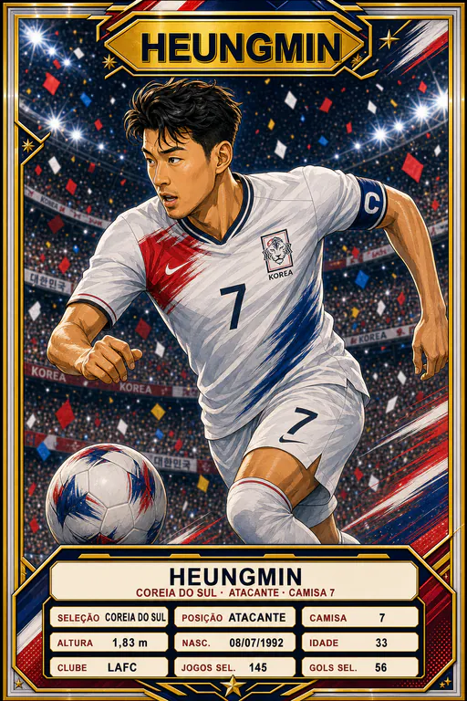 | Heung Min SON | Atacante | 7 | LAFC (USA)
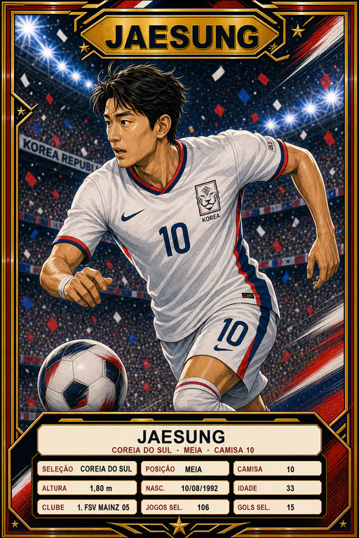 | Jae Sung LEE | Meio-campista | 10 | 1. FSV Mainz 05 (GER)
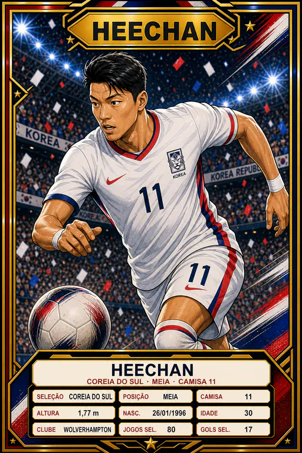 | Hee Chan HWANG | Meio-campista | 11 | Wolverhampton Wanderers FC (ENG)

## Mexico (MEX)

| Figurinha | Jogador | Posicao | Camisa | Clube |
|---|---|---|---:|---|
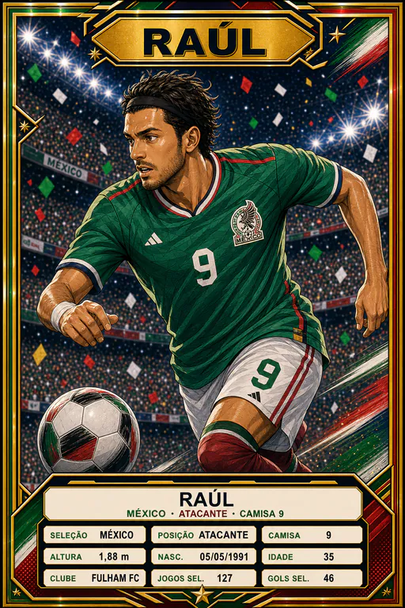 | Raúl Alonso JIMÉNEZ RODRÍGUEZ | Atacante | 9 | Fulham FC (ENG)

## Morocco (MAR)

| Figurinha | Jogador | Posicao | Camisa | Clube |
|---|---|---|---:|---|
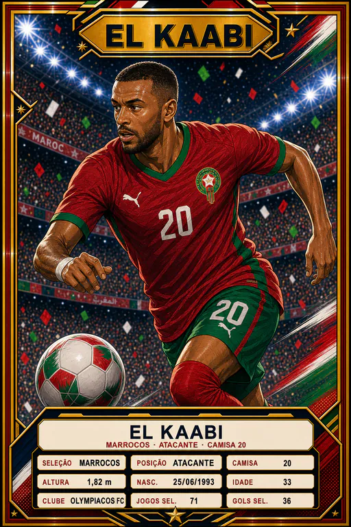 | Ayoub EL KAABI | Atacante | 20 | Olympiacos FC (GRE)

## Netherlands (NED)

| Figurinha | Jogador | Posicao | Camisa | Clube |
|---|---|---|---:|---|
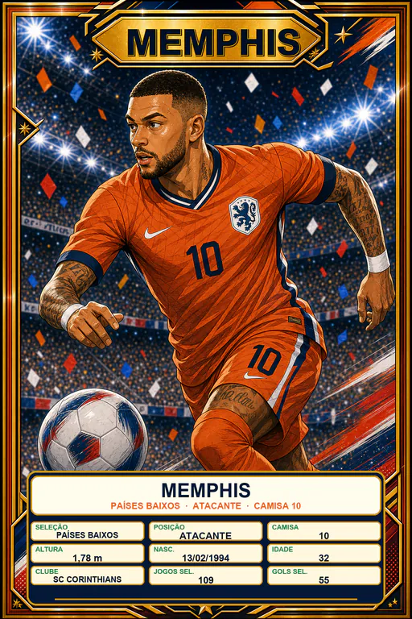 | Memphis DEPAY | Atacante | 10 | SC Corinthians (BRA)
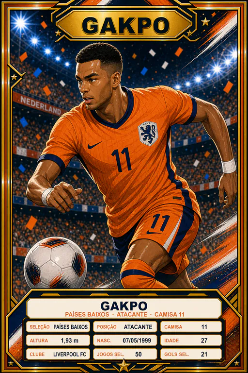 | Cody Mathès GAKPO | Atacante | 11 | Liverpool FC (ENG)

## New Zealand (NZL)

| Figurinha | Jogador | Posicao | Camisa | Clube |
|---|---|---|---:|---|
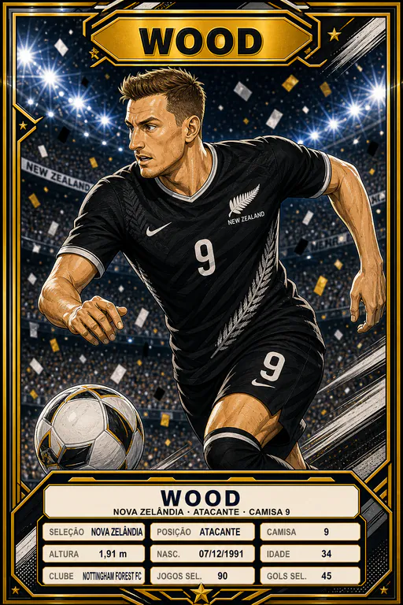 | Christopher Grant WOOD | Atacante | 9 | Nottingham Forest FC (ENG)

## Norway (NOR)

| Figurinha | Jogador | Posicao | Camisa | Clube |
|---|---|---|---:|---|
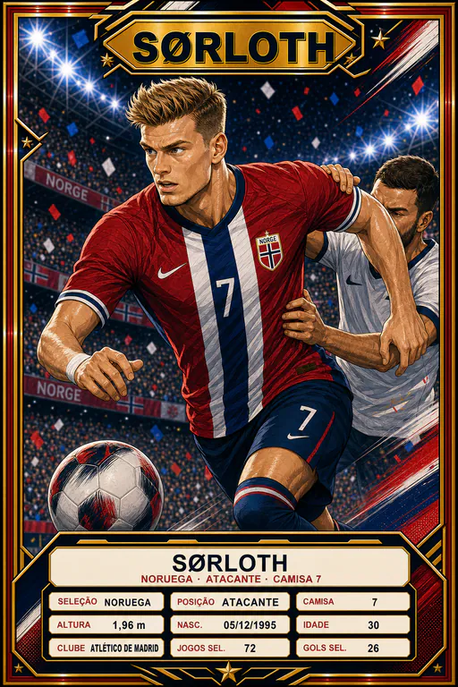 | Alexander SØRLOTH | Atacante | 7 | Atlético De Madrid (ESP)
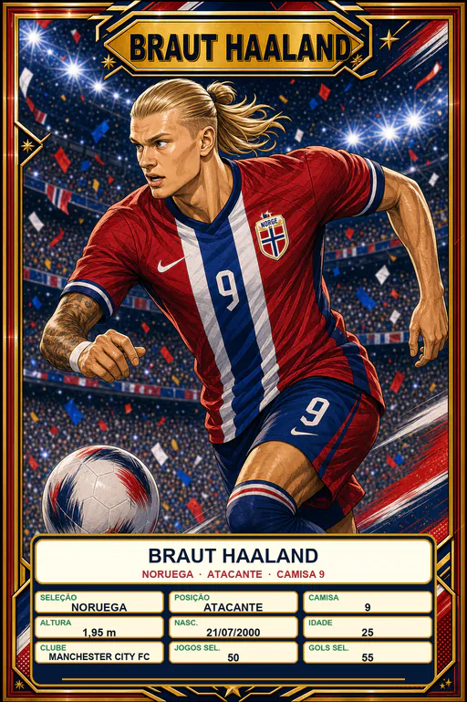 | Erling Braut HAALAND | Atacante | 9 | Manchester City FC (ENG)

## Panama (PAN)

| Figurinha | Jogador | Posicao | Camisa | Clube |
|---|---|---|---:|---|
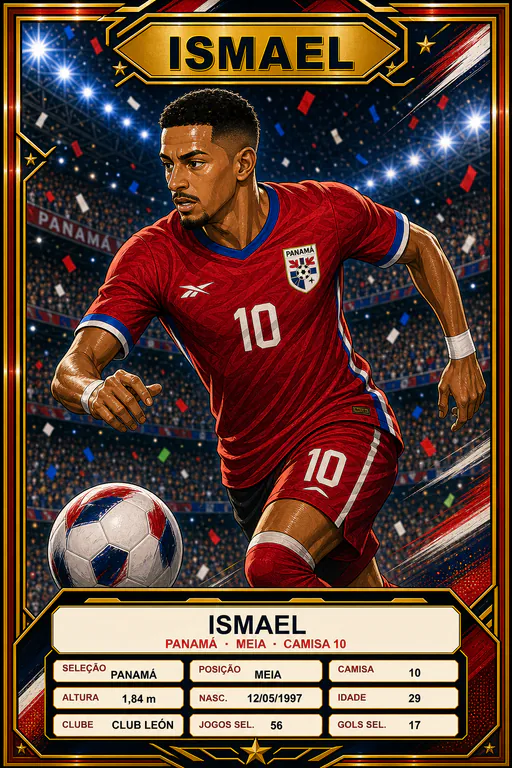 | Ismael DIAZ DE LEON | Meio-campista | 10 | Club León (MEX)
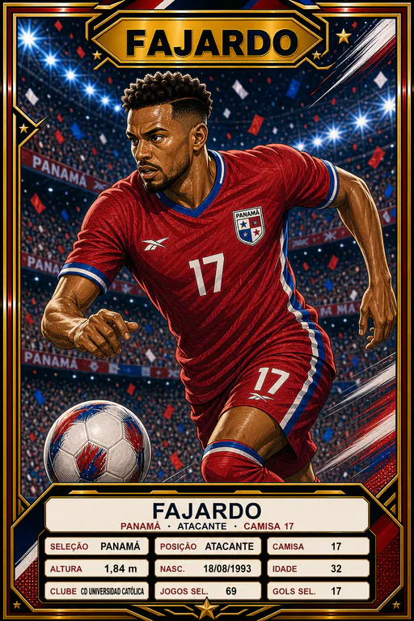 | Jose FAJARDO NELSON | Atacante | 17 | CD Universidad Católica (ECU)

## Portugal (POR)

| Figurinha | Jogador | Posicao | Camisa | Clube |
|---|---|---|---:|---|
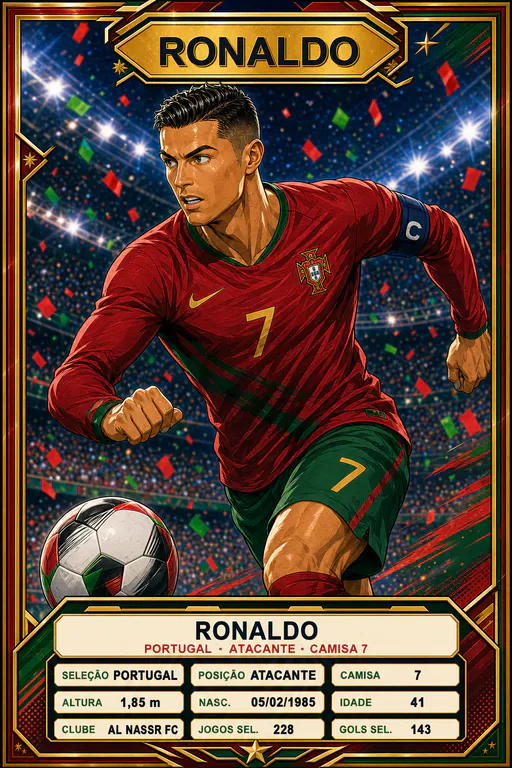 | Cristiano Ronaldo DOS SANTOS AVEIRO | Atacante | 7 | Al Nassr FC (KSA)
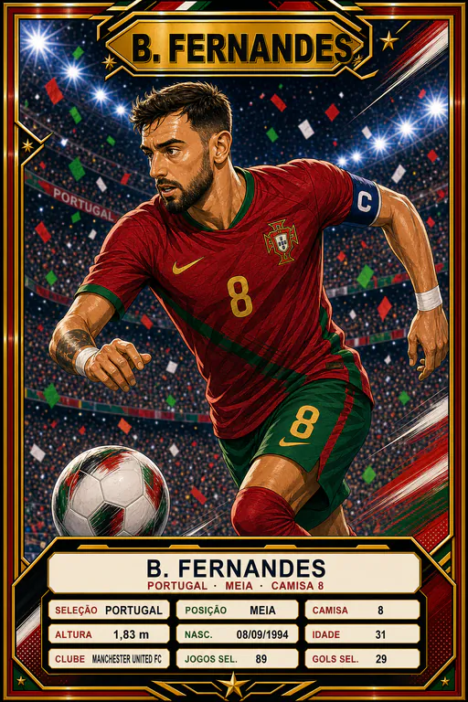 | Bruno Miguel BORGES FERNANDES | Meio-campista | 8 | Manchester United FC (ENG)

## Qatar (QAT)

| Figurinha | Jogador | Posicao | Camisa | Clube |
|---|---|---|---:|---|
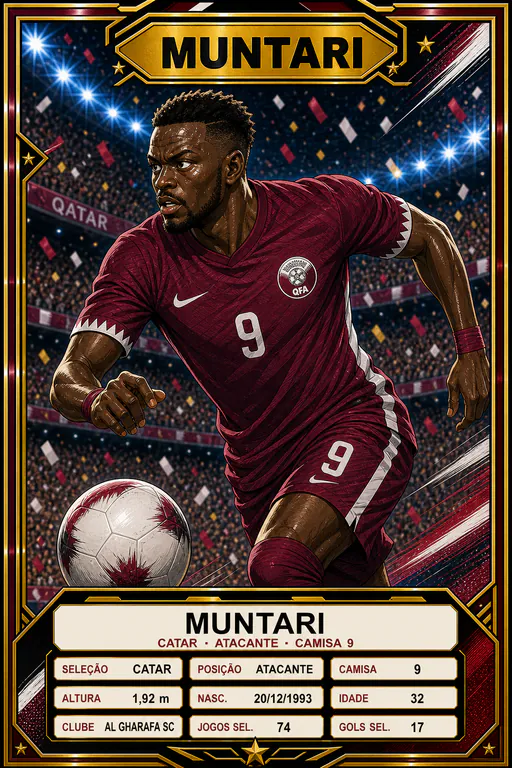 | Mohammed MUNTARI | Atacante | 9 | Al Gharafa SC (QAT)
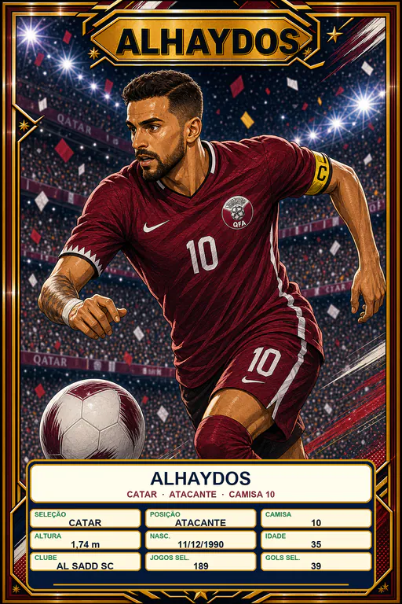 | Hasan Khalid H ALHAYDOS | Atacante | 10 | Al Sadd SC (QAT)
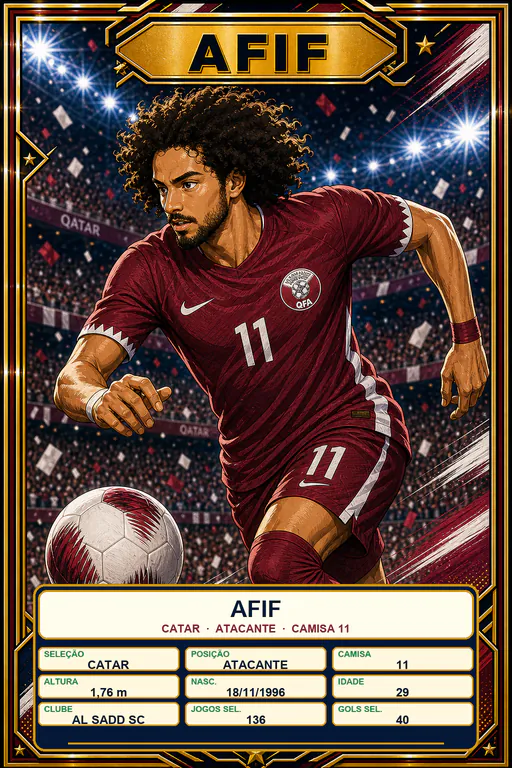 | Akram Hassan A Y AFIF | Atacante | 11 | Al Sadd SC (QAT)
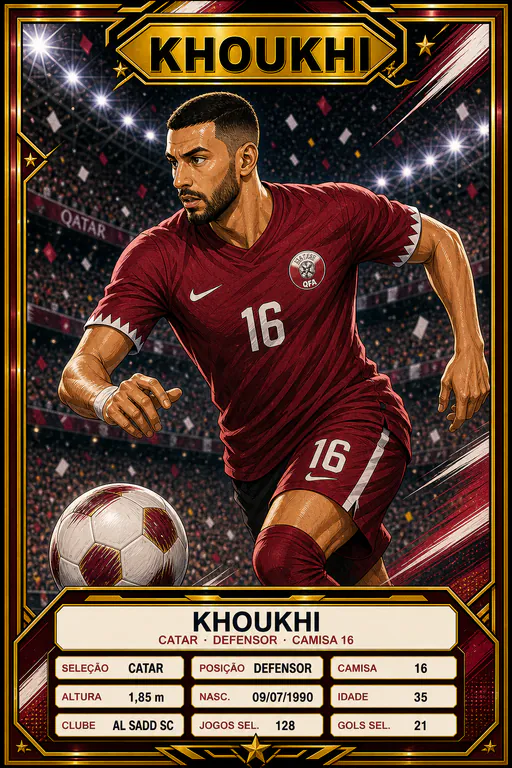 | Boualem KHOUKHI | Defensor | 16 | Al Sadd SC (QAT)
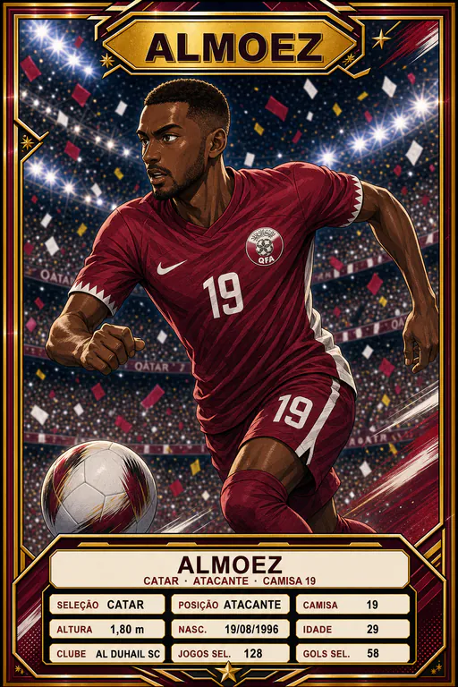 | Almoez Ali Zainelabdeen M ABDULLA | Atacante | 19 | Al Duhail SC (QAT)

## Saudi Arabia (KSA)

| Figurinha | Jogador | Posicao | Camisa | Clube |
|---|---|---|---:|---|
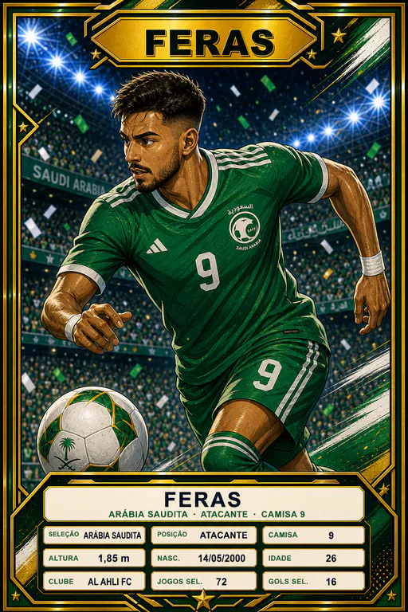 | Feras Tariq N ALBRIKAN | Atacante | 9 | Al Ahli FC (KSA)
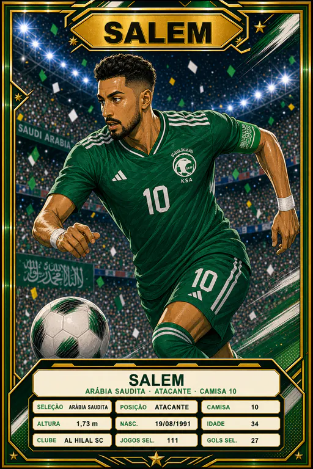 | Salem Mohammed S ALDAWSARI | Atacante | 10 | Al Hilal SC (KSA)
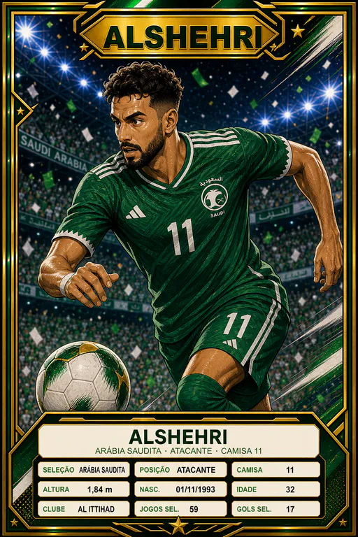 | Saleh Khalid M ALSHEHRI | Atacante | 11 | Al Ittihad (KSA)

## Scotland (SCO)

| Figurinha | Jogador | Posicao | Camisa | Clube |
|---|---|---|---:|---|
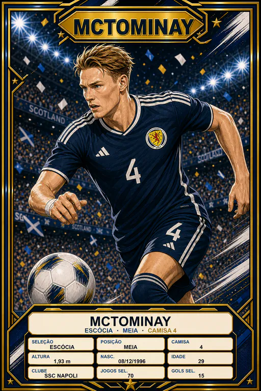 | Scott Francis MCTOMINAY | Meio-campista | 4 | SSC Napoli (ITA)
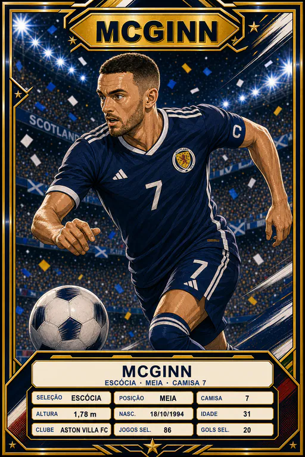 | John MCGINN | Meio-campista | 7 | Aston Villa FC (ENG)

## Senegal (SEN)

| Figurinha | Jogador | Posicao | Camisa | Clube |
|---|---|---|---:|---|
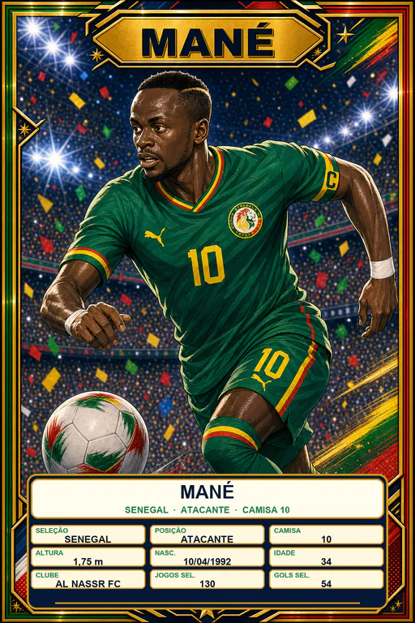 | Sadio MANÉ | Atacante | 10 | Al Nassr FC (KSA)
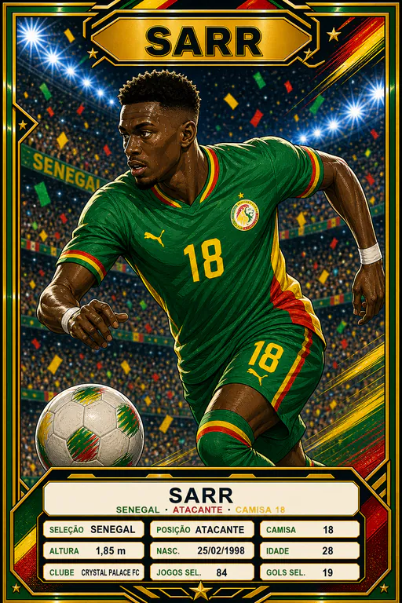 | Ismaila SARR | Atacante | 18 | Crystal Palace FC (ENG)

## Spain (ESP)

| Figurinha | Jogador | Posicao | Camisa | Clube |
|---|---|---|---:|---|
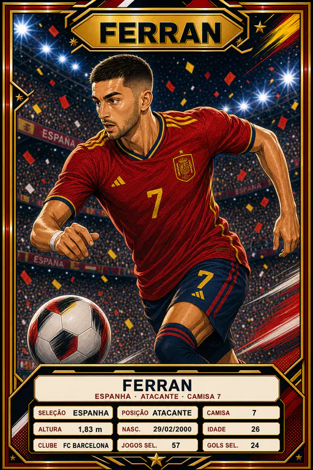 | Ferran TORRES GARCÍA | Atacante | 7 | FC Barcelona (ESP)
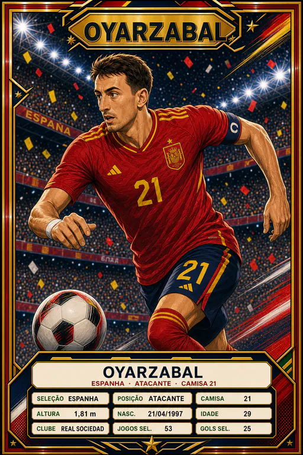 | Mikel OYARZABAL UGARTE | Atacante | 21 | Real Sociedad (ESP)

## Sweden (SWE)

| Figurinha | Jogador | Posicao | Camisa | Clube |
|---|---|---|---:|---|
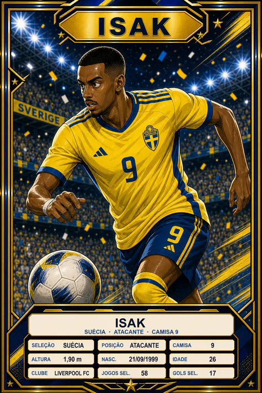 | Alexander ISAK | Atacante | 9 | Liverpool FC (ENG)
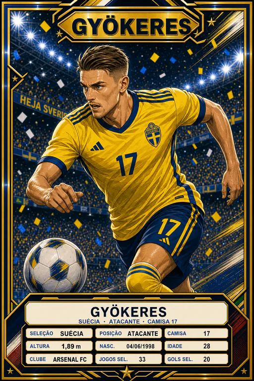 | Viktor Einar GYÖKERES | Atacante | 17 | Arsenal FC (ENG)

## Switzerland (SUI)

| Figurinha | Jogador | Posicao | Camisa | Clube |
|---|---|---|---:|---|
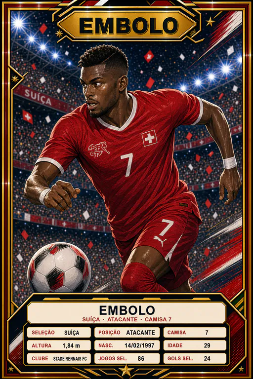 | Breel Donald EMBOLO | Atacante | 7 | Stade Rennais FC (FRA)
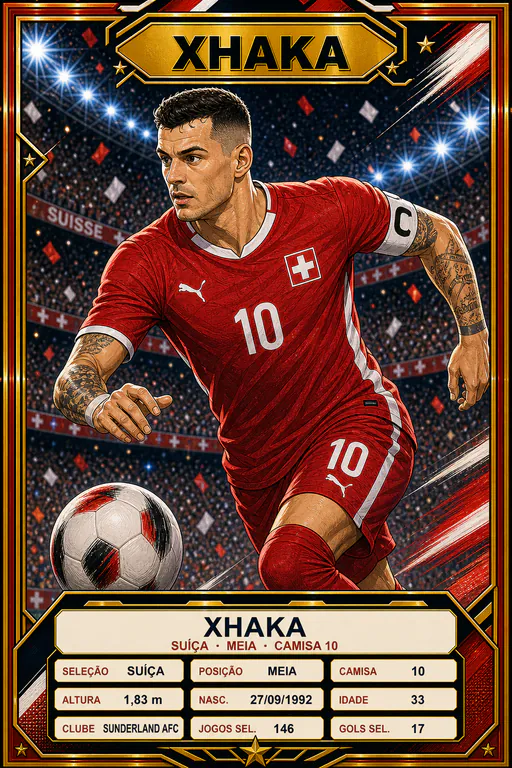 | Granit XHAKA | Meio-campista | 10 | Sunderland AFC (ENG)

## Türkiye (TUR)

| Figurinha | Jogador | Posicao | Camisa | Clube |
|---|---|---|---:|---|
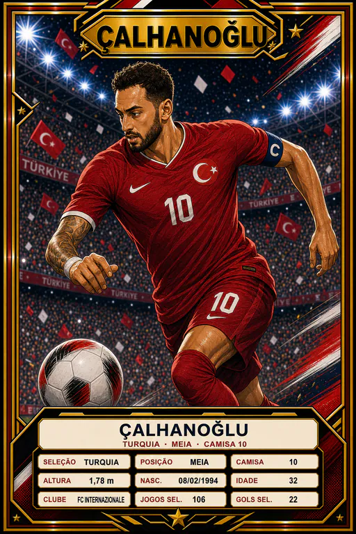 | Hakan ÇALHANOĞLU | Meio-campista | 10 | FC Internazionale Milano (ITA)

## USA (USA)

| Figurinha | Jogador | Posicao | Camisa | Clube |
|---|---|---|---:|---|
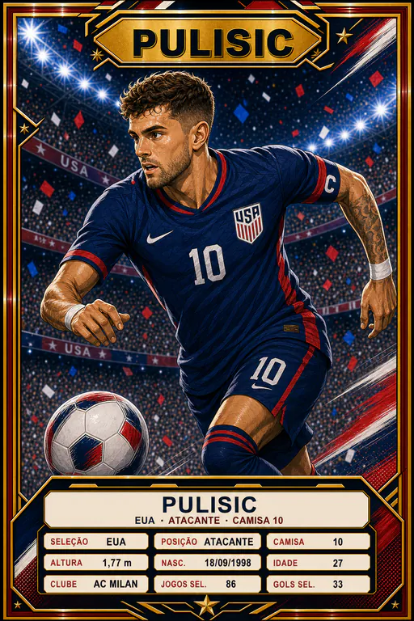 | Christian Mate PULISIC | Atacante | 10 | AC Milan (ITA)

## Uzbekistan (UZB)

| Figurinha | Jogador | Posicao | Camisa | Clube |
|---|---|---|---:|---|
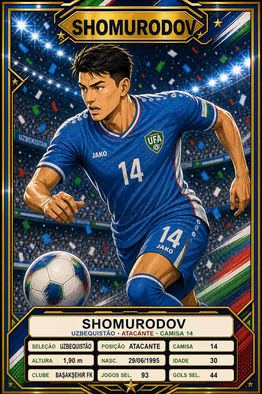 | Eldor SHOMURODOV | Atacante | 14 | Başakşehir FK (TUR)
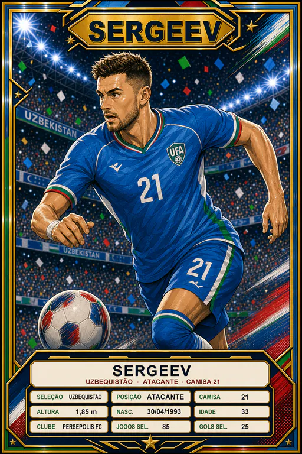 | Igor SERGEEV | Atacante | 21 | Persepolis FC (IRN)

